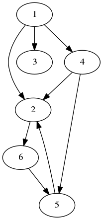

# a library providing graph data structures and algorithms

To get started, you can import this repo directly in your program:

``` go
import "github.com/tlehman/graph"
```

Then new up a graph and start adding to it:

``` go
g := graph.New()  // defaults to directed, unweighted
g.addEdge(1, 2)
g.addEdge(1, 3)
g.addEdge(1, 4)
g.addEdge(4, 5)
g.addEdge(5, 2)
g.addEdge(4, 2)
g.addEdge(2, 6)
g.addEdge(6, 5)
fmt.Println(g)
```



By default the graph prints out in the <a href="https://en.wikipedia.org/wiki/DOT_(graph_description_language">DOT graph description language</a>

# Algorithms
After adding everything to the graph, you can perform:

- [ ] Breadth-first search
- [ ] Find connected components
- [ ] Find minimum spanning trees (only relevant if weighted)
- [ ] Compute distances between vertices
